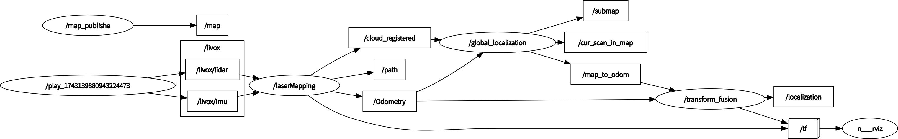

# FAST-LIO-LOCALIZATION

A simple localization framework that can re-localize in built maps based on [FAST-LIO] and works with ROS Noetic(https://github.com/hku-mars/FAST_LIO). 

## News
2025-2-27
在livox_ros_driver2, python3, ROS-noetic环境下运行，适配Livox Hap Tx激光雷达

## 1. Features
- Realtime 3D global localization in a pre-built point cloud map. 
  By fusing low-frequency global localization (about 0.5~0.2Hz), and high-frequency odometry from FAST-LIO, the entire system is computationally efficient.

<div align="center"></div>

- Eliminate the accumulative error of the odometry.

<div align="center"></div>

- The initial localization can be provided either by rough manual estimation from RVIZ, or pose from another sensor/algorithm.

<!--  -->
<!-- [](https://youtu.be/2OvjGnxszf8) -->
<div align="center">


</div>


## 2. Prerequisites
### 2.1 Dependencies for FAST-LIO

Technically, if you have built and run FAST-LIO before, you may skip section 2.1.

This part of dependency is consistent with FAST-LIO, please refer to the documentation https://github.com/hku-mars/FAST_LIO#1-prerequisites

### 2.2 Dependencies for localization module

- ~~python 2.7~~ python 3.8

- [ros_numpy](https://github.com/eric-wieser/ros_numpy)

```shell
sudo apt install ros-$ROS_DISTRO-ros-numpy
pip install numpy==1.21
```

- [Open3D](http://www.open3d.org/docs/0.9.0/getting_started.html)

~~pip install open3d==0.9~~
pip install open3d==0.13

~~Notice that, there may be issue when installing **Open3D** directly using pip in **Python2.7**:~~

~~you may firstly install **pyrsistent**:~~

~~Then~~

~~pip install open3d==0.9~~
Just pip install open3d==0.13 (or later version)


## 3. Build
Clone the repository and catkin_make:

```
    cd ~/$A_ROS_DIR$/src
    git clone https://github.com/HViktorTsoi/FAST_LIO_LOCALIZATION.git
    cd FAST_LIO_LOCALIZATION
    git submodule update --init
    cd ../..
    catkin_make
    source devel/setup.bash
```
- Remember to source the livox_ros_driver before build (follow [livox_ros_driver](https://github.com/hku-mars/FAST_LIO#13-livox_ros_driver))
- If you want to use a custom build of PCL, add the following line to ~/.bashrc
  ```export PCL_ROOT={CUSTOM_PCL_PATH}```


## 4. 运行定位算法
### 4.0 准备步骤
1.终端进入工作空间根目录\
2.加载工作空间环境变量
```bash
source devel/setup.bash
```

### 4.1 打开点云地图

* 打开示例点云地图,使用livox hap tx：
```bash
roslaunch fast_lio_localization localization_hap_tx.launch
```
Wait for 3~5 seconds until the map cloud shows up in RVIZ;

* 运行我自己的点云图，则是输入以下代码
```bash
roslaunch fast_lio_localization localization_hap_tx.launch map:="$(rospack find fast_lio_localization)/../../E6_basement.pcd"
```
记得修改成你的点云地图路径

### 4.2 启动动态点云输入
 
1.输入点云数据

* 播放rosbag（提前采好的动态点云），新开一个终端:
```shell
rosbag play localization_test.bag --topics /livox/lidar /livox/imu
```

* 实时运行激光雷达以获得点云数据：
```shell
roslaunch livox_ros_driver2 msg_HAP.launch
```

2.提供初始位姿

使用RVIZ中的'2D Pose Estimate'工具提供初始位姿估计。

注意，在初始化阶段，最好保持机器人静止不动。或者如果你播放数据包，首先播放大约0.5秒的数据，然后暂停数据包直到初始化成功。

* 或者直接播放所有话题的rosbag，包括建图结果
```shell
rosbag play localization_test.bag
```

### 5.结果

1.ros rqt_graph 



2.里程计轨迹图


3.定位轨迹图


4.轨迹比较图


## Related Works
1. [FAST-LIO](https://github.com/hku-mars/FAST_LIO): A computationally efficient and robust LiDAR-inertial odometry (LIO) package
2. [ikd-Tree](https://github.com/hku-mars/ikd-Tree): A state-of-art dynamic KD-Tree for 3D kNN search.
3. [FAST-LIO-SLAM](https://github.com/gisbi-kim/FAST_LIO_SLAM): The integration of FAST-LIO with [Scan-Context](https://github.com/irapkaist/scancontext) **loop closure** module.
4. [LIO-SAM_based_relocalization](https://github.com/Gaochao-hit/LIO-SAM_based_relocalization): A simple system that can relocalize a robot on a built map based on LIO-SAM.


## Acknowledgments
Thanks for the authors of [FAST-LIO](https://github.com/hku-mars/FAST_LIO) and [LIO-SAM_based_relocalization](https://github.com/Gaochao-hit/LIO-SAM_based_relocalization).
