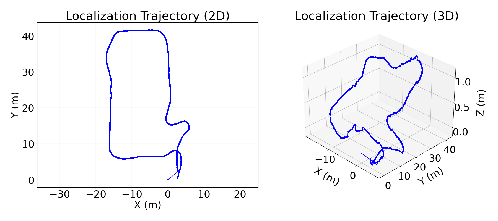

# FAST-LIO-LOCALIZATION

一个简单的定位框架，可以基于 [FAST-LIO] 在已构建的地图中重新定位，并适用于 ROS Noetic(https://github.com/hku-mars/FAST_LIO)。

## 更新
2025-2-27
在livox_ros_driver2, python3, ROS-noetic环境下运行，适配Livox Hap Tx激光雷达

## 1. 特性
- 在预先构建的点云地图中进行实时三维全局定位。
  通过融合低频全局定位（约 0.5~0.2Hz）和来自 FAST-LIO 的高频里程计，整个系统计算效率高。

<div align="center"></div>

- 消除里程计的累积误差。

<div align="center"></div>

- 初始定位可以通过 RVIZ 中的粗略手动估计，或来自其他传感器/算法的位姿来提供。

<!--  -->
<!-- [](https://youtu.be/2OvjGnxszf8) -->
<div align="center">


</div>


## 2. 先决条件
### 2.1 FAST-LIO的依赖项

从技术上讲，如果您之前已经构建并运行过FAST-LIO，可以跳过第2.1节。

这一部分的依赖项与FAST-LIO一致，请参考文档 https://github.com/hku-mars/FAST_LIO#1-prerequisites

### 2.2 本地化模块的依赖关系

- python 3.8

- [ros_numpy](https://github.com/eric-wieser/ros_numpy)

```shell
sudo apt install ros-$ROS_DISTRO-ros-numpy
pip install numpy==1.21
```

- [Open3D](http://www.open3d.org/docs/0.9.0/getting_started.html)


Just pip install open3d==0.13 (or later version)


## 3. 构建
克隆代码库并使用catkin_make：

```
    cd ~/$A_ROS_DIR$/src
    git clone https://github.com/XC-CN/FAST_LIO_LOCALIZATION_in_LivoxHapTx.git
    cd FAST_LIO_LOCALIZATION
    git submodule update --init
    cd ../..
    catkin_make
    source devel/setup.bash
```
- 请记得在构建之前先加载livox_ros_driver（请参考 [livox_ros_driver](https://github.com/hku-mars/FAST_LIO#13-livox_ros_driver)）
- 如果您想使用自定义构建的PCL，请在~/.bashrc中添加以下行
  ```export PCL_ROOT={CUSTOM_PCL_PATH}```


## 4. 运行定位算法
### 4.0 准备步骤
1.终端进入工作空间根目录\
2.加载工作空间环境变量
```bash
source devel/setup.bash
```

### 4.1 打开点云地图

* 打开示例点云地图,使用livox hap tx：
```bash
roslaunch fast_lio_localization localization_hap_tx.launch
```
Wait for 3~5 seconds until the map cloud shows up in RVIZ;

* 运行我自己的点云图，则是输入以下代码
```bash
roslaunch fast_lio_localization localization_hap_tx.launch map:="$(rospack find fast_lio_localization)/../../E6_basement.pcd"
```
记得修改成你的点云地图路径

### 4.2 启动动态点云输入
 
1.输入点云数据

* 播放rosbag（提前采好的动态点云），新开一个终端:
```shell
rosbag play localization_test.bag --topics /livox/lidar /livox/imu
```

* 实时运行激光雷达以获得点云数据：
```shell
roslaunch livox_ros_driver2 msg_HAP.launch
```

2.提供初始位姿

使用RVIZ中的'2D Pose Estimate'工具提供初始位姿估计。

注意，在初始化阶段，最好保持机器人静止不动。或者如果你播放数据包，首先播放大约0.5秒的数据，然后暂停数据包直到初始化成功。

* 或者直接播放所有话题的rosbag，包括建图结果
```shell
rosbag play localization_test.bag
```

### 5.轨迹对比

新建了src/path_evaluation文件夹，里面有extract_odometry.py和extract_localization.py，分别提取里程计和定位的轨迹，然后使用compare_trajectories.py将这两个轨迹分别绘制出来。最后使用evaluation.py进行可视化评估。

1.ros rqt_graph 


2.FAST-LIO2里程计（/Odometry）轨迹图


3.FAST-LIO_LOCALIZATION定位（/localization）轨迹图



4.轨迹比较图


## 相关工作
1. [FAST-LIO](https://github.com/hku-mars/FAST_LIO)：一个计算高效且稳健的激光雷达惯性里程计（LIO）包
2. [ikd-Tree](https://github.com/hku-mars/ikd-Tree)：一种最先进的动态KD树，用于3D kNN搜索。
3. [FAST-LIO-SLAM](https://github.com/gisbi-kim/FAST_LIO_SLAM)：将FAST-LIO与[Scan-Context](https://github.com/irapkaist/scancontext) **回环闭合**模块集成。
4. [LIO-SAM_based_relocalization](https://github.com/Gaochao-hit/LIO-SAM_based_relocalization)：一个简单的系统，可以基于LIO-SAM在构建的地图上重新定位机器人。

## 致谢
感谢[FAST-LIO](https://github.com/hku-mars/FAST_LIO)和[LIO-SAM_based_relocalization](https://github.com/Gaochao-hit/LIO-SAM_based_relocalization)的作者。
